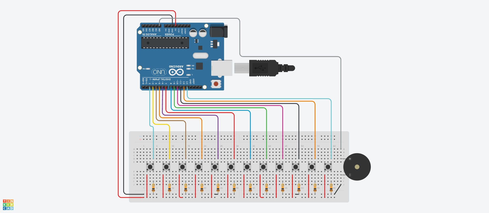

# Arduino Piano 12key

## Overview

This project implements a 12-key digital piano using an Arduino Uno, twelve push buttons, resistors, and a piezo buzzer. Each push button represents one note in a chromatic octave from C4 to B4. When a button is pressed, the Arduino generates the corresponding frequency through the buzzer, allowing the user to play natural notes and sharps across a complete octave.

## Components Used

| Component | Description |
|-----------|-------------|
| Arduino Uno | The microcontroller that reads the buttons and generates musical tones |
| 12 × Push Buttons | Used as piano keys to select the twelve musical notes |
| 12 × 10kΩ Resistors | Used as pull-down resistors to stabilize the button input signals |
| Piezo Buzzer | Produces the musical tone selected by the pressed button |
| Breadboard / PCB | Used to assemble and hold the circuit components |
| Jumper Wires | Used to connect the Arduino, buttons, resistors, and buzzer |

## Functionality

* Each of the twelve push buttons plays a different note from C4 to B4.
* The Arduino checks the buttons continuously and plays the first detected note.
* The piezo buzzer produces the selected frequency for as long as the button remains pressed.
* When the button is released, the buzzer stops producing sound.
* Only one note plays at a time, creating a simple monophonic digital piano.

## Code Explanation

This Arduino program stores the twelve button pins in one array and their corresponding note frequencies in another. A `for` loop checks each button using `digitalRead()`. When a pressed button is detected, the `tone()` function sends the matching frequency to the piezo buzzer, and the loop stops checking additional buttons. A Boolean variable records whether a note is active. If no button is pressed, the `noTone()` function stops the buzzer.

### Pin Setup

The twelve push buttons are connected to Arduino digital pins **D2 through D13**. Each button uses a **10kΩ pull-down resistor** to keep its input LOW when it is not pressed. The positive terminal of the piezo buzzer is connected to analog pin **A0**, which is used as a digital output for the tone signal. The buzzer’s negative terminal and all button circuits share the Arduino’s **GND** connection, while the buttons receive power from the Arduino’s **5V** output.

### Behaviour

When the system starts, the Arduino waits for a piano key to be pressed. Pressing a button plays its assigned note continuously through the piezo buzzer. The twelve frequencies are **262, 277, 294, 311, 330, 349, 370, 392, 415, 440, 466, and 494 Hz**, representing the chromatic notes from C4 to B4. Releasing the button stops the sound. If several buttons are pressed together, the program plays the note connected to the lowest-numbered Arduino pin because it is detected first.

## Simulation

Created and tested using Autodesk [Tinkercad Circuits](https://www.tinkercad.com/circuits).

## License

This project is licensed under the [MIT License](../LICENSE).
