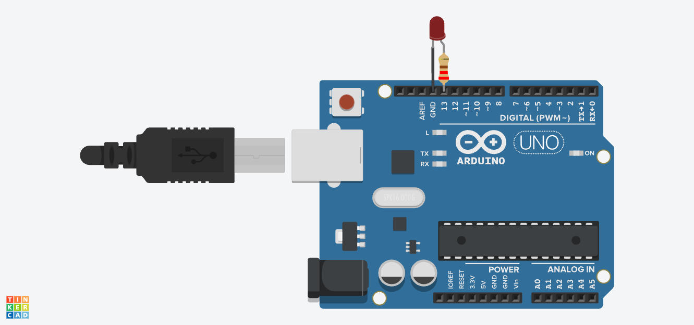

# Blink LED Circuit

## Overview

This project implements a simple LED blinking circuit using an Arduino Uno, a red LED, and a resistor. The Arduino turns the LED on for one second and then off for one second. This sequence repeats continuously, demonstrating how a digital output can be used to control an LED.

## Components Used

| Component | Description |
|-----------|-------------|
| Arduino Uno | The microcontroller that runs the program and controls the LED |
| Red LED | Used as the visual output that blinks on and off |
| 220Ω Resistor | Limits the current flowing through the LED to protect it |

## Functionality

* When the system starts, the Arduino turns the red LED on for 1 second.
* The LED then turns off for 1 second.
* This sequence repeats continuously, creating a steady blinking effect.

## Code Explanation

This Arduino program controls a red LED using a digital output pin. The `pinMode()` function configures the LED pin as an output in `setup()`. The program uses `digitalWrite()` to turn the LED on and off, while `delay()` keeps it in each state for **1 second**. The instructions inside `loop()` repeat continuously to create the blinking effect.

### Pin Setup

The red LED is connected to digital pin **D13**, which sends the signal from the Arduino to turn the LED on or off. The LED is connected through a **220Ω resistor** to limit the current and protect it, with the circuit returning to the Arduino’s **GND** pin.

### Behaviour

When the system starts, the Arduino sends a HIGH signal to the LED pin, turning the LED on for **1 second**. It then sends a LOW signal, turning the LED off for **1 second**. This sequence repeats continuously, causing the LED to blink at a steady rate.

## Simulation

Created and tested using Autodesk [Tinkercad Circuits](https://www.tinkercad.com/circuits).

## License

This project is licensed under the [MIT License](../LICENSE).
