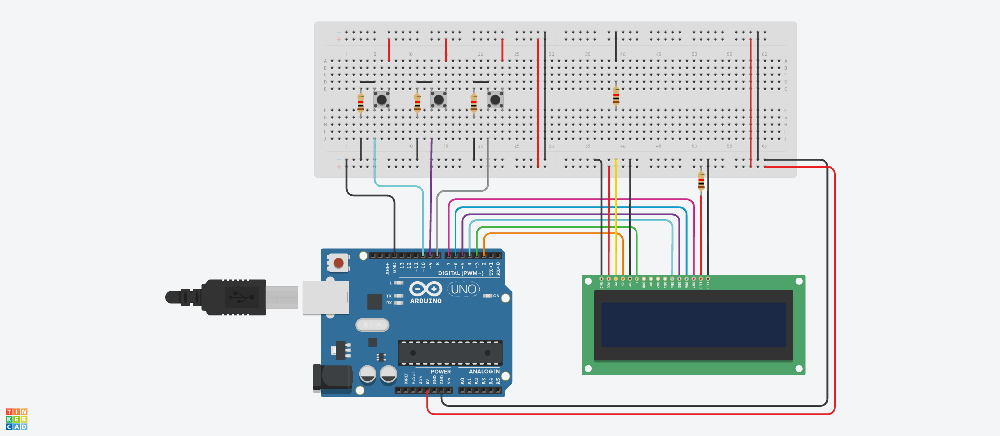

# Digital Clock

## Overview

This project implements a digital clock and calendar using an Arduino Uno, a 16x2 LCD, and three push buttons. The LCD uses custom characters to display large hours and minutes while also showing the seconds and date. The buttons allow the user to set the hours, minutes, day, and month directly from the circuit.

## Components Used

| Component | Description |
|-----------|-------------|
| Arduino Uno | Runs the clock program and controls the display and buttons |
| 16x2 LCD | Displays the time and date |
| 3 × Push Buttons | Used to select a setting and increase or decrease its value |
| 5 × 1kΩ Resistors | Support the button inputs and LCD connections |
| Breadboard | Holds and connects the circuit components |
| Jumper Wires | Connect the Arduino, LCD, buttons, and resistors |

## Functionality

* The clock displays time in a 24-hour format.
* Large custom LCD characters display the hours and minutes.
* The seconds appear on the upper-right side of the LCD.
* A compact month indicator and two-digit day appear on the lower-right side.
* The center separator blinks every 0.5 seconds.
* The date advances automatically when the clock passes midnight.
* Three buttons allow the hours, minutes, day, and month to be adjusted.
* The clock pauses while a value is being changed and resumes after setup is complete.

## Setting the Time and Date

The **SET** button moves through the available settings. The **UP** and **DOWN** buttons change the selected value.

1. Press **SET once** to select the **hour**. Use **UP** or **DOWN** to choose a value from 00 to 23.
2. Press **SET a second time** to select the **minutes**. Use **UP** or **DOWN** to choose a value from 00 to 59.
3. Press **SET a third time** to select the **day**. Use **UP** or **DOWN** to choose a valid day for the selected month.
4. Press **SET a fourth time** to select the **month**. Use **UP** or **DOWN** to choose a month from 1 to 12.
5. Press **SET a fifth time** to finish setup and return to normal clock operation.

The program automatically adjusts the day if the selected month contains fewer days. For example, changing from a 31-day month to a 30-day month changes day 31 to day 30.

## Code Explanation

The program uses the `LiquidCrystal` library to control the 16x2 LCD. Eight custom LCD characters are combined to create large digits for the hours and minutes. The `millis()` function measures elapsed time without continuously stopping the program, allowing the Arduino to update the clock and read the buttons.

The `updateClock()` function advances the seconds, minutes, hours, day, and month. The `checkButtons()` function detects button presses and changes the selected setting. The `displayClock()` function draws the large time digits, blinking separators, seconds, and date on the LCD.

### Pin Setup

The LCD **RS pin is connected to D2**, and its **Enable pin is connected to D3**. The LCD data pins **D4, D5, D6, and D7** connect to Arduino pins **D4, D5, D6, and D7**, respectively.

The **SET button is connected to D8**, the **UP button to D9**, and the **DOWN button to D10**. The buttons use external pull-down resistors, so an unpressed button reads LOW and a pressed button reads HIGH. The LCD and button circuit share the Arduino's **5V** and **GND** connections.

### Behaviour

When powered on, the clock starts at **00:00:00** on **1 January**. The center separators blink every 0.5 seconds, and the seconds increase once per second. After 59 seconds, the minutes increase; after 59 minutes, the hours increase; and after 23:59:59, the date moves to the next day.

January through September are represented by their month number. October, November, and December use **O**, **N**, and **D** as compact month indicators. The program uses the normal number of days for each month and treats February as 28 days.

The clock uses `millis()` for timekeeping and does not include a real-time clock module. Its time and date reset when the Arduino restarts or loses power.

## Simulation

Created and tested using Autodesk [Tinkercad Circuits](https://www.tinkercad.com/circuits).

## License

This project is licensed under the [MIT License](../LICENSE).
