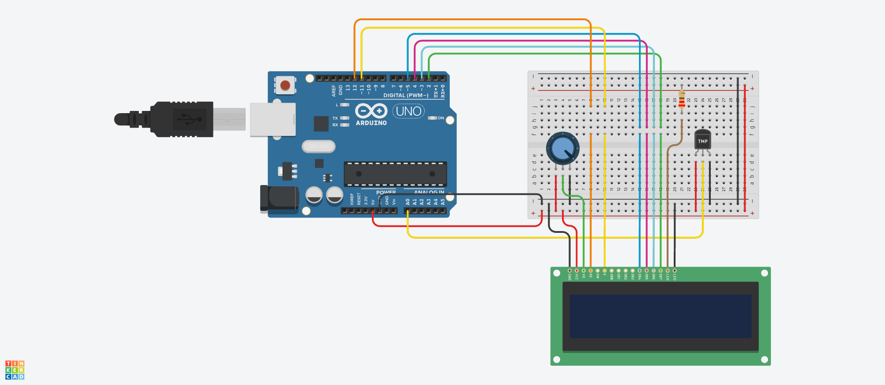

# Digital Thermometer with LCD Display

## Overview

This project implements a digital thermometer using an Arduino Uno, a TMP36 temperature sensor, and a 16x2 LCD. The Arduino reads the temperature sensor, converts the measured voltage into degrees Celsius, and displays the current temperature on the LCD. A potentiometer allows the user to adjust the display contrast, making the temperature reading easier to read.

## Components Used

| Component | Description |
|-----------|-------------|
| Arduino Uno | The microcontroller that reads the temperature sensor and controls the LCD |
| TMP36 Temperature Sensor | Measures the surrounding temperature and sends an analog signal to the Arduino |
| 16x2 LCD | Displays the current temperature in degrees Celsius |
| 10kΩ Potentiometer | Used to adjust the contrast of the LCD |
| 220Ω Resistor | Limits the current flowing through the LCD backlight |
| Breadboard / PCB | Used to assemble and hold the circuit components |
| Jumper Wires | Used to connect the Arduino, temperature sensor, LCD, potentiometer, and resistor |

## Functionality

* When the system starts, the LCD displays the text “Current Temp:” on the first row.
* The TMP36 sensor continuously measures the surrounding temperature.
* The Arduino converts the analog sensor reading into degrees Celsius.
* The current temperature is displayed on the second row with one decimal place and a degree symbol.
* The display updates every 500 milliseconds, while the potentiometer allows the LCD contrast to be adjusted.

## Code Explanation

This Arduino program uses the `LiquidCrystal` library to control a 16x2 LCD. The `analogRead()` function reads the TMP36 sensor and returns a value between 0 and 1023. The program converts this reading into a voltage, subtracts the TMP36 offset of **0.5 volts**, and multiplies the result by 100 to calculate the temperature in degrees Celsius. It creates a custom degree symbol, displays the temperature with one decimal place, and uses `delay()` to wait **500 milliseconds** between updates.

### Pin Setup

The TMP36 output pin is connected to analog pin **A0**, which allows the Arduino to measure the sensor voltage. The LCD’s **RS pin is connected to D12**, and its **Enable pin is connected to D11**. The LCD data pins **D4, D5, D6, and D7** are connected to Arduino digital pins **D5, D4, D3, and D2**, respectively. The **10kΩ potentiometer** adjusts the LCD contrast through its **VO pin**, while the **220Ω resistor** limits the current through the LCD backlight. The circuit is powered using the Arduino’s **5V** and **GND** connections, and the LCD’s **RW pin is connected to GND**.

### Behaviour

When the system starts, the Arduino initializes the LCD and displays “Current Temp:” on the first row. It then reads the TMP36 sensor, calculates the temperature, and shows the result on the second row with one decimal place followed by **°C**. The reading updates every **500 milliseconds** as the surrounding temperature changes. Extra spaces are printed after each value to clear any digits left from a previous longer reading, while the potentiometer controls the display contrast.

## Simulation

Created and tested using Autodesk [Tinkercad Circuits](https://www.tinkercad.com/circuits).

## License

This project is licensed under the [MIT License](../LICENSE).
