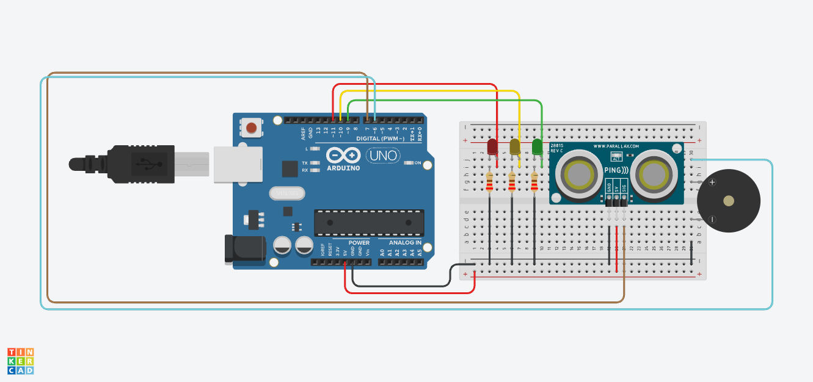

# Parking Sensor

## Overview

This project implements a parking assistance system using an Arduino Uno and a three-pin ultrasonic distance sensor. The sensor measures the distance between the circuit and a nearby object, while red, yellow, and green LEDs indicate how close the object is. A piezo buzzer provides audible warnings that become more frequent as the object moves closer.

## Components Used

| Component | Description |
|-----------|-------------|
| Arduino Uno | The microcontroller that measures distance and controls the output devices |
| Ultrasonic Distance Sensor | Detects nearby objects and measures their distance from the circuit |
| Red LED | Indicates that an object is 30 cm away or closer |
| Yellow LED | Indicates that an object is between 31 cm and 79 cm away |
| Green LED | Indicates that an object is between 80 cm and 150 cm away |
| Piezo Buzzer | Produces audible parking warnings based on the measured distance |
| 3 × 220Ω Resistors | Limit the current flowing through the LEDs to protect them |
| Breadboard / PCB | Used to assemble and hold the circuit components |
| Jumper Wires | Used to connect the Arduino, sensor, LEDs, resistors, and buzzer |

## Functionality

* The ultrasonic sensor continuously measures the distance to a nearby object.
* The red LED turns on when the object is 30 cm away or closer.
* The yellow LED turns on when the object is between 31 cm and 79 cm away.
* The green LED turns on when the object is between 80 cm and 150 cm away.
* The buzzer sounds continuously in the red zone, beeps quickly in the yellow zone, and beeps slowly in the green zone.
* All LEDs and the buzzer remain off when no object is detected or the object is more than 150 cm away.
* The measured distance is displayed in the Serial Monitor at 9600 baud.

## Code Explanation

The program uses a single Arduino pin to trigger the three-pin ultrasonic sensor and receive its echo signal. The `getDistanceCM()` function changes the sensor pin to an output, sends a short trigger pulse, and then changes it to an input to measure the returning echo with `pulseIn()`. The echo duration is divided by 58 to calculate the distance in centimetres.

The main loop first turns all outputs off and then compares the measured distance with three distance ranges. It activates the appropriate LED and buzzer pattern for the current range. A 30-millisecond sensor timeout returns `-1` when no echo is received, preventing the system from treating a missing object as a close obstacle.

### Pin Setup

The red LED is connected to Arduino digital pin **D11**, the yellow LED to **D10**, and the green LED to **D9**. Each LED uses a **220Ω resistor** to limit the current. The three-pin ultrasonic sensor signal connection is connected to **D7**, which is used for both the trigger and echo signals. The piezo buzzer is connected to **D6**. The sensor and output components share the Arduino’s **5V** and **GND** connections.

### Behaviour

When the system starts, it repeatedly measures the distance to the nearest object. At distances from **80 cm to 150 cm**, the green LED turns on and the buzzer produces a slow warning beep. From **31 cm to 79 cm**, the yellow LED turns on and the buzzer beeps more quickly. At **30 cm or closer**, the red LED turns on and the buzzer sounds continuously to warn that the object is very close. If no echo is detected or the object is farther than 150 cm, all indicators remain off.

## Simulation

Created and tested using Autodesk [Tinkercad Circuits](https://www.tinkercad.com/circuits).

## License

This project is licensed under the [MIT License](../LICENSE).
