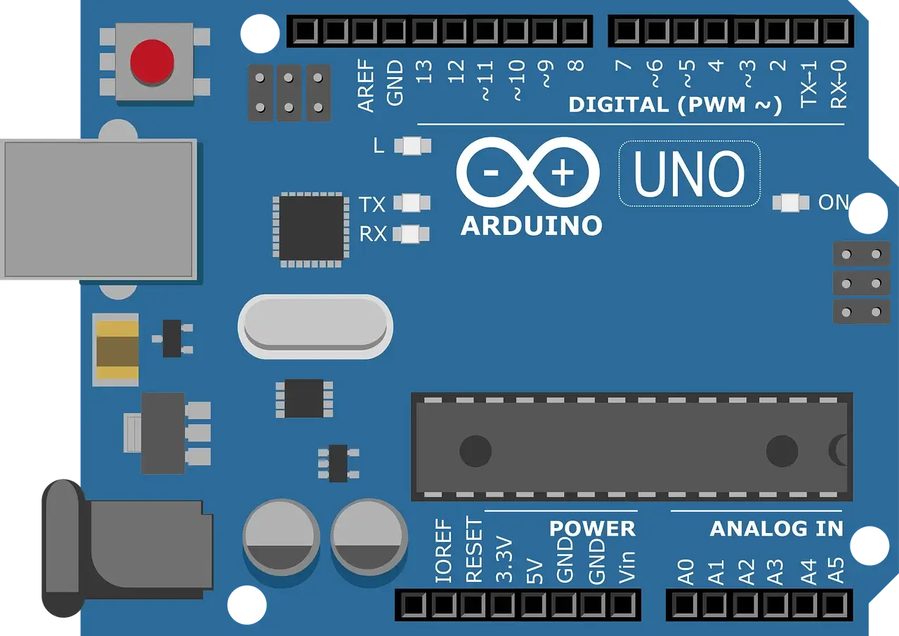

# Arduino-Tinkercad-Projects

Hello everyone, in this repository I store all the Arduino projects that I create and simulate using [Tinkercad Circuits](https://www.tinkercad.com/circuits). These projects are designed to explore Arduino programming, electronics, and circuit design. This repository is aimed at students, hobbyists, and anyone who wants to learn Arduino through practical simulation projects.

---

## 🔧 What’s Inside

This repository contains multiple Arduino projects, each organized in its own folder with the required files and project details.

- Circuit image (.png)
- Arduino code (.ino)
- Components list (.csv)
- Description (.md)
- Schematic view (.pdf)

---

## 📂 Project List

| Project | Description |
|---------|-------------|
| 3-LED Control System | A simple traffic light simulation using red, orange, and green LEDs. |
| Arduino 16x2 LCD Interface | A scrolling text display that shows “Loading Data” on a 16x2 LCD, with a potentiometer to adjust the contrast. |
| Arduino Blink LED Circuit | A simple circuit that turns a red LED on and off at one-second intervals to create a steady blinking effect. |
| Arduino Multi-Tasking LED Controller | A circuit that blinks a blue LED automatically while a push button independently controls a green LED. |
| Arduino Piano | A small digital piano built with Arduino where buttons act as keys to play musical notes. |
| Arduino Traffic Light Simulator | A traffic light simulation that cycles through red, green, and yellow LEDs at timed intervals. |
| Multi-LED Digital Controller with On-Off Switch | A circuit that controls multiple LEDs with a switch to produce a back-and-forth scanning light effect. |
| Push Button LED Controller | A simple circuit where a push button controls the turning on and off of an LED. |
| Smart Night Light | An automatic lighting system that uses a photoresistor to turn an LED on in dark conditions and off in brighter conditions. |
| Solar Tracking System Using LDR Sensors | A simple system that uses LDR sensors to detect and follow the strongest light source. |

More projects will be added over time.

---

## 🛠 Tools Used

- [Tinkercad Circuits](https://www.tinkercad.com/circuits) – Free online Arduino simulator.

---

## 🤝 Contributing

Suggestions and improvements are welcome. Feel free to fork the repository and submit a pull request.

---

## 📜 License

This project is licensed under the [MIT License](https://github.com/AndreasFragkop/Arduino-Tinkercad-Projects/blob/main/LICENSE).
