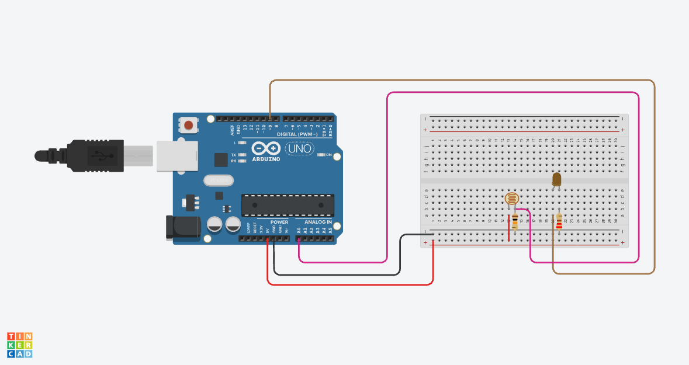

# Smart Night Light

## Overview

This project implements a simple automatic night light using an Arduino Uno, a photoresistor, an LED, and resistors. The photoresistor measures the surrounding light level, allowing the Arduino to turn the LED on when it becomes dark and turn it off when sufficient light is detected. The system continuously monitors the light level to provide automatic lighting without manual control.

## Components Used

| Component | Description |
|-----------|-------------|
| Arduino Uno | The microcontroller that reads the light level and controls the LED |
| Photoresistor | Detects changes in the surrounding light level |
| Orange LED | Provides light when the surroundings become dark |
| 10kΩ Resistor | Forms a voltage divider with the photoresistor to produce a stable sensor signal |
| 220Ω Resistor | Limits the current flowing through the LED to protect it |
| Breadboard / PCB | Used to assemble and hold the circuit components |
| Jumper Wires | Used to connect the Arduino, photoresistor, resistors, and LED |

## Functionality

* The photoresistor continuously measures the surrounding light level.
* When the sensor value falls below the threshold of 500, the orange LED turns on.
* When the sensor value reaches or exceeds the threshold, the LED turns off.
* The Arduino sends the measured light level to the Serial Monitor at 9600 baud.
* The system checks the light level every 100 milliseconds and responds automatically to changes.

## Code Explanation

This Arduino program reads the photoresistor using the `analogRead()` function and stores the measured light level as a value between 0 and 1023. It compares this value with a threshold of **500**. When the value is below the threshold, `digitalWrite()` turns the LED on. When the value reaches or exceeds the threshold, the LED turns off. The program also displays each sensor reading in the Serial Monitor and uses `delay()` to wait **100 milliseconds** between readings.

### Pin Setup

The photoresistor voltage signal is connected to analog pin **A0**, which allows the Arduino to measure the surrounding light level. The orange LED is connected to digital pin **D9**, which is configured as an output. A **10kΩ resistor** forms a voltage divider with the photoresistor, while a **220Ω resistor** limits the current flowing through the LED. The circuit is powered using the Arduino’s **5V** and **GND** connections.

### Behaviour

When the system starts, the Arduino continuously reads the photoresistor and compares the measured value with the threshold of **500**. In dark conditions, the sensor value falls below the threshold and the orange LED turns on. In brighter conditions, the sensor value reaches or exceeds the threshold and the LED turns off. The system repeats this process every **100 milliseconds**, allowing the night light to respond quickly to changes in the surrounding light level.

## Simulation

Created and tested using Autodesk [Tinkercad Circuits](https://www.tinkercad.com/circuits).

## License

This project is licensed under the [MIT License](../LICENSE).
